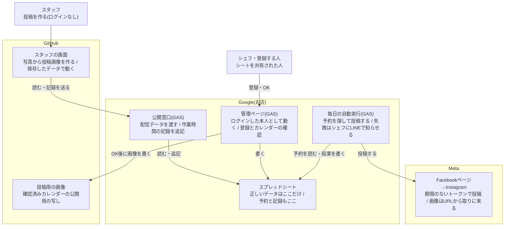
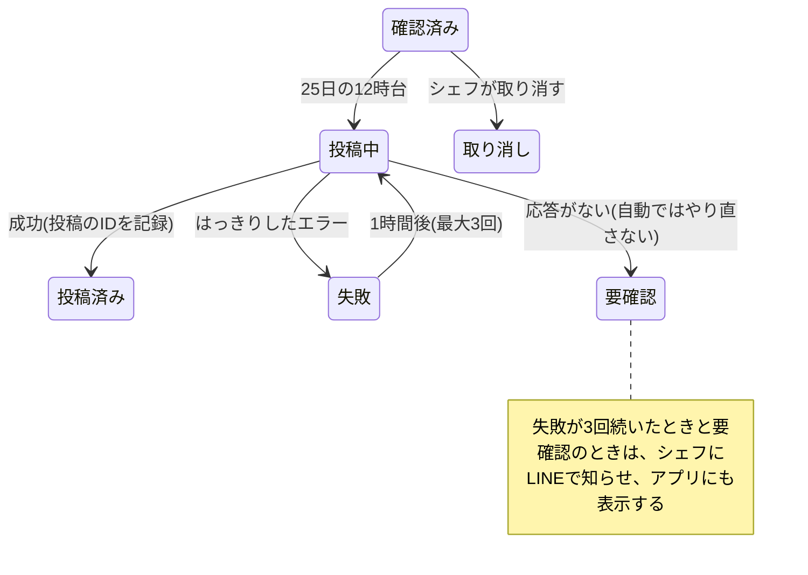

# 投稿ノート 技術構成の検討書

2026年10月9日時点

## 目的と前提

この文書で決めるのは、「投稿ノート」のデータの置き場所、ログイン、画面の公開場所、営業カレンダーの自動投稿を、どの技術の組み合わせで作るかです。10月7日の面談で「管理のしやすさを一番に、使う技術を吟味し直すように」と助言を受け、一から検討し直しました。

### やりたいこと

- 最大8人(シェフ、奥さん、アルバイト6人)がスマホで使う
- 投稿を作るだけならログインなしで使える。写真は端末の外に出さない
- ひとこと、商品、お店の設定、営業カレンダーは、アプリの中から登録できる。登録できるのは決まった人だけ
- シェフが営業カレンダーにOKを出したら、決めた日にInstagramへ自動で投稿する

### 守ること

- **無料で続けられること**:カードの登録がいるプランにしない(10月9日に確定)
- **引き継げること**:私がいなくなったあとも、お店だけで困らない
- **仮のアカウントで作り、あとでシェフのアカウントへ移すこと**:完成して実用が認められてから移す。移すことを最初から設計に入れる
- **お店の本番アカウントを危険にさらさないこと**:自動投稿はテスト用アカウントで確かめてから使う

### 分かっていること

- お店のInstagramはプロアカウントで、Facebookページとつながっている
- テスト用アカウントでは、画像のフィードとストーリーズをAPIから投稿できた。画像は公開URLのJPEGが必要だった
- 画面の部分(画像づくり、投稿の流れ)は、どの構成を選んでも共通で使える
- お店の再開は10月17日の予定、発表は10月23日

## 判断の基準

一番重く見るのは、引き継いだあとにお店が困らないことです。そのため、作りやすさより、動かし続けるときの手間と、壊れたときの直しやすさを先に見ます。

| 順 | 基準 | 見るところ |
| --- | --- | --- |
| 1 | 管理する場所の数 | ログインが必要なサービスはいくつか。それぞれに何があるか |
| 2 | 持ち主と移しやすさ | シェフのアカウントへ移せるか。移したときにURLが変わらないか |
| 3 | データの整合性 | 正しいデータが1か所に決まっているか。同時に書いても壊れないか |
| 4 | 失敗の検知と復旧 | 自動投稿が失敗したときに、シェフが気づけて手で出せるか。二重に投稿しないか |
| 5 | 秘密の情報の扱い | トークンなどの置き場所が少なく、権限が必要な分だけか。期限切れの管理がいるか |
| 6 | 費用と止まる条件 | 無料の範囲に収まるか。使わない期間があると止まるものはないか |
| 7 | 保守 | 定期的に人の手がいる作業はあるか |
| 8 | 作る量 | 10月23日の発表までに作って検証できるか |

## 候補の構成

候補は4つです。画面の部分はどれも同じで、違うのは「裏側」の組み合わせです。

| 部品 | A いまの案 | A' FirebaseとGAS | C Google中心 | D Cloudflare |
| --- | --- | --- | --- | --- |
| スタッフの画面 | GitHub Pages | GitHub Pages | GitHub Pages | Cloudflare Pages |
| 正しいデータの置き場所 | Firestore | Firestore | スプレッドシート | D1(データベース) |
| 登録とログイン | アプリ内、FirebaseのGoogleログイン | アプリ内、FirebaseのGoogleログイン | GASの管理ページ。Googleにログインした本人として動く | アプリ内。Googleログインの確認を自分で書く |
| だれが登録できるか | Firestoreのルールと名簿 | 同左 | シートを共有された人 | 自分で書く名簿 |
| 毎日の自動実行 | GitHub Actions | GASのトリガー | GASのトリガー | Cron Triggers |
| 秘密の置き場所 | GitHub Secrets(トークン、Firebaseの鍵) | GASの設定欄(トークン、Firebaseの鍵、GitHubの鍵) | GASの設定欄(トークン、GitHubの鍵) | Cloudflareのシークレット |
| 投稿用画像のURL | GitHub Pages | GitHub Pages | GitHub Pages | Workersから直接出す |
| 失敗の知らせ | GitHubの英語のメール(開発者宛) | GASからシェフにメール | GASからシェフにLINE | 自分で作る |
| ログインして管理する場所 | Firebase、GitHub | Firebase、GAS、GitHub | Googleドライブ(シートとGAS)、GitHub | Cloudflare |

4つとも、Instagramへはお店のFacebookページ経由でつなぎます。この部分は案によらず同じです。

どの案にも共通する制約が3つあります。

- **画像は公開されたJPEGのURLが必要**:サイズは8MBまでです。Googleドライブの共有リンクは、2025年ごろから受けつけられなくなったという報告が続いています。そのためA〜Cはどれも、画像をGitHub Pagesに置きます
- **Firebaseの無料プランでは、決まった時刻に動く処理と画像の保存場所が使えない**:AとA'は、自動投稿をFirebaseの外に作ることになります
- **GitHub Actionsの定期実行は時刻が遅れることがある**:公開リポジトリでは、60日間動きがないと止まります

自動投稿を作らず、Instagramの公式の予約投稿を手で使う案(E)も、比べるときの基準として残します。この場合、裏側はAかCの登録の部分だけになります。

### 追加で検討した案

10月9日に、上の候補に入っていない案を調べ直しました。「カードは登録しない」と決めたため、Fは外れます。

| 案 | 内容 | 判断 |
| --- | --- | --- |
| F Firebaseの従量課金プラン | 決まった時刻の処理と画像置き場が使え、すべてFirebaseにまとまる。請求は無料枠に収まる見込み | 支払い方法の登録が必須。予算アラートは使いすぎを止めない。カードを登録しないので見送り |
| Supabase | ログイン、データ、公開できる画像置き場、定期実行が無料で1か所にそろう | 無料プランは1週間ほど利用が少ないと一時停止する。定期実行だけで止まらないかは公式に書かれていない。休業があるお店には危ないので見送り |
| Make(ノーコードの自動化) | 自動投稿の部分を画面上の操作で作れる | 無料は月1,000クレジット、動かせる自動化は2つまで。登録の問題は解決せず、管理する場所が増えるだけなので見送り |
| Vercel | Dと同じく1か所にまとまる | 無料プランは個人の非商用に限られるので見送り |
| 予約投稿ツール(Meta Business Suite、Bufferなど) | 公式・外部の予約投稿 | 手で予約する点がEと同じ。逃げ道として使う |
| iPhoneのショートカット | シェフのスマホが決まった時刻に投稿する | 1台の端末に頼るので、電池切れや機種変更で止まる。見送り |
| LINE公式アカウント(Cに足す部品) | 確認のお知らせや失敗の知らせを、メールのかわりにLINEで送る | Cに足せる。ただし「知らせを送るだけ」に限る(比較と結論の節) |

## 比較と結論

C(Google中心)を推します。管理の大半がお店のGoogleアカウントに収まり、データも登録できる人も「表」と「共有」という、シェフがすでに知っている形で管理できるからです。

| 基準 | A いまの案 | A' FirebaseとGAS | C Google中心 | D Cloudflare |
| --- | --- | --- | --- | --- |
| 1 管理する場所の数 | △ 2か所。自動投稿がGitHub側に分かれる | △ 3か所 | ○ 2か所。GitHubは画面と画像を置くだけ | ○ 1か所 |
| 2 持ち主と移しやすさ | △ Firebaseの持ち主の追加、鍵の作り直し | △ 同左とGAS | ○ ドライブのオーナー譲渡で移せる | △ アカウント間の移し方を確認できていない |
| 3 データの整合性 | ○ ルールで守れる | ○ 同左 | △ シートを直接直すと崩れる。検査と版番号で補う | ○ データベースで守れる |
| 4 失敗の検知と復旧 | × 開発者に英語のメール | ○ シェフにメール | ○ シェフにLINE。表で状態が見える | △ 自分で作る |
| 5 秘密の情報 | △ 2つ | × 3つ | ○ 3つ(LINEを含む) | ○ 1つ |
| 6 費用と止まる条件 | △ 60日動きがないと定期実行が止まる | ○ 無料 | ○ 無料 | ○ 無料 |
| 7 保守 | △ ルールのテストが必要 | △ 同左 | ○ 表と共有で済む | △ 専門的な管理画面 |
| 8 作る量 | ○ 設計済み | △ 中 | △ 中 | × 裏側を一から |

### Cを選ぶ理由

- **登録できる人の管理が「シートの共有」だけで済む**:管理ページは、Googleにログインした本人として動きます。シートを共有されていない人は書きこめません。ログイン確認のコードを自分で書かなくてよく、だれが何を変えたかはシートの変更履歴に残ります
- **自動投稿がGASの中で完結する**:毎日の実行、トークンの保管、失敗したときの知らせまでを、引き継ぐときに1つのファイルとして移せます
- **移す手順がGoogleドライブの普通の操作になる**:個人アカウントの間でも、オーナー権限を譲渡できます(相手の承諾が必要)
- **Facebookページ経由のトークンには期限がない**:60日ごとの更新という壊れやすい部分がなくなります。ただし、10月10日の検証で、ページのトークンにも90日の「データアクセスの有効期限」がつくことが分かりました(「段階2の検証結果」の節)。期限の日を記録して前もって知らせ、10分ほどで作り直せる手順を残して補います

### Cであきらめること

- **登録画面がアプリとは別のページになる**:アプリの「登録」ボタンから開く形にはできます。ただし画面の上にGoogleの注意書きが出て、初回は「確認されていないアプリ」の画面を通ります。以前決めた「アプリ内で完結する」を少しゆるめることになります
- **シートは直接書きかえられてしまう**:困ったときに表で直せる利点でもあります。その分、読みこむときの検査を必ず入れます(データの整合性の節)
- **画像を置くためだけにGitHubの鍵が1つ残る**

### ほかの案を選ばない理由

- **A**:自動投稿の失敗が英語のメールで開発者に届きます。引き継いだあとに気づける人がいません。定期実行が止まる条件もあります
- **A'**:ログインとデータの守りはいちばん強いです。ただし管理する場所と秘密が3つずつになり、データは専門的な画面でしか見られません。「登録画面をアプリの中に置くこと」を優先するなら、この案が次点です
- **D**:1か所にまとまりますが、シェフが開くことのない専門的な管理画面になります。裏側を一から書く量も、発表までには多すぎます
- **E**:管理はいちばん楽です。ただし、シェフが毎月画像を保存して日時を入れる手間が残ります。Cの自動投稿が止まったときの逃げ道として使います

メンターからの「なぜFirebaseなのか」という問いへの答えは、「ログインとデータの守りには向いているが、無料プランでは自動投稿を中に置けず、管理する場所が増える」です。そのため、今回は使わないことにしました。

### カードを登録しない前提での結論(10月9日)

カードを登録しないと決めたので、追加で検討した案を含めてもCがいちばん管理しやすいという結論は変わりません。カードを登録できればFが上でした。

### 知らせをLINEで送る場合

シェフはメールをあまり見ず、ふだん見るのはInstagramのDMとLINEです。そのため、知らせはLINEで送ることにしました(10月9日)。カレンダーのOKはLINEでは受けず、これまでどおり管理ページで押します。

OKをLINEで受けない理由は2つです。

- **本物のOKか確かめられない**:LINEは、届ける知らせが本物だと示す署名をリクエストのヘッダーにつけます。しかしGASの受け口の説明にはヘッダーを読む項目がなく、署名を確かめられません。このままでは、偽の「OK」を防げません
- **GASだけでは確認用の画像を作れない**:カレンダー画像はブラウザで描いているので、管理ページを開かないと画像ができません

作り方は次のとおりです。

- **お客さん向けとは別の、お店の中だけで使うLINE公式アカウントを作る**:友だちはシェフ(と奥さん)だけにし、友だち全員への送信で届けます。お客さん向けのアカウントで送ると、お客さんに届いてしまいます
- **送るのは月に数通**:「11月のカレンダーを確認してください」と管理ページへのリンク、失敗の知らせです。無料プランの月200通に収まります
- **秘密が1つ増える**:期限のない「長期のチャネルアクセストークン」をGASの設定欄に置きます

LINEを足すと、管理する場所もLINEの分で1つ増えます。それでも、見てもらえない知らせでは失敗に気づけないので足します。

InstagramのDMは使いません。Instagramのメッセージの仕組みでは、お店のアカウントから会話を始められません。相手が先に送ってきたときに、24時間以内に返信できるだけです。そのため、こちらからの知らせには向きません。

## 推奨構成の全体図

正しいデータはスプレッドシート1つです。そこに書けるのは管理ページと毎日の自動実行だけで、スタッフの画面は公開窓口を通して読むことと記録の追記しかできません。

### 5つの流れ

1. **投稿を作る(スタッフ)**:画面を開くと、公開窓口から配信データを受け取り、端末に保存します。写真は端末の外に出しません
2. **登録する(シェフなど)**:アプリの「登録」から管理ページを開きます。管理ページはログインした本人としてシートに書くので、シートを共有されていない人は書けません
3. **カレンダーを確認する(シェフ)**:管理ページで画像を作り、OKを押すと、原本をドライブに、公開用の写しをGitHubに置き、シートに予約の行を作ります
4. **自動で投稿する(GAS)**:毎日の自動実行が予約を探し、FacebookページのトークンでInstagramに投稿します。Instagramは、GitHubに置いた画像をURLから取りに来ます。結果はシートに書き、失敗したらシェフにLINEで知らせます
5. **作業時間を記録する**:スタッフの画面が公開窓口に送り、シートに追記します。追記以外はできません

### コードの管理

画面のコードとGASのコードは、同じGitHubのリポジトリで管理します。カレンダー画像を描くコードは1つだけにし、管理ページもスタッフの画面も同じものを読みこみます。こうすると、管理ページで確認した画像と、アプリで作る画像の見た目がずれません。

### シェフが触るのはアプリ1つ

シェフの入り口は、ホーム画面のアプリだけにします(10月9日に決定)。管理ページは仕組みのうえではGASの別のページですが、シェフがそのURLを覚えたり探したりすることはありません。

- **アプリから開く**:アプリのメニューに「登録・確認(お店の人用)」を置きます。確認のお知らせが出ているときは、最初の画面の「確認する」から、カレンダーの確認画面を直接開きます
- **終わったらアプリに戻る**:管理ページの上に「アプリに戻る」を置きます
- **見た目をそろえる**:色、文字、ボタンの形は、アプリと同じファイルを読みこみます
- **LINEの知らせもアプリを開く**:リンクは管理ページではなくアプリに向けます。LINEの中のブラウザではなく、いつものブラウザで開く指定をつけます

それでも残る違いが2つあります。管理ページの上にGoogleの注意書きが出ることと、最初の1回だけ許可の画面が出ることです。許可の画面は、手順書を見ながら一緒に1回だけ通ります。

管理ページをアプリの画面の中に埋めこむ方法もあります。ただしiPhoneのSafariは、埋めこんだ別のサイトではログインの情報を使わせないため、ログインが通らないおそれがあります。検証計画の12で確かめ、通らなければ上の「開いて戻る」形にします。

## データの整合性

正しいデータはスプレッドシート1つだけにし、ほかの場所にあるものはすべて「版番号つきの写し」として扱います。

| データ | 正しいもの | 写し | 写しが古いと分かる方法 |
| --- | --- | --- | --- |
| ひとこと、商品、お店の設定 | シート | スタッフの端末に保存した配信データ | 版番号を比べる |
| 営業カレンダーの予約 | シートの予約の行 | なし | — |
| カレンダー画像 | ドライブの原本(非公開) | GitHub Pagesの公開用の写し | 予約の行に記録した大きさとハッシュ値で確かめる |
| 作業時間の記録 | シートの記録の行(追記だけ) | なし | — |

### 書きこみのルール

1. **書きこむ入り口は2つだけ**:管理ページ(登録と確認)と、公開窓口の「記録の追記」です。公開窓口は、記録の追記以外は読むことしかできません
2. **同時に保存しても壊れない**:保存はGASのロック機能で一件ずつ処理します
3. **後からの保存が前の変更を消さない**:管理ページは、開いたときの版番号をつけて保存します。その間にほかの人が変えていたら保存をことわり、「ほかの人が先に変えました」と表示して読み直します
4. **保存するたびに版番号を1つ上げる**:「設定」シートに版番号を置きます
5. **行には変わらないIDを振る**:並べる順番は別の列にします。行を並べ替えても、予約や記録からの参照がずれません
6. **消さずに「しまう」**:使わなくなった商品やひとことは、非表示の印をつけるだけにします
7. **日付は文字で持つ**:「2026-11-01」のように書き、時刻は日本時間にそろえます。シートの日付型は、時差で日がずれることがあるため使いません

### シートを直接直したときの備え

- 見出し行とIDの列は保護し、選ぶ列には入力規則をつけます
- 配信する前に、すべての行を検査します(必須の項目、文字数、選べる値)。合わない行は配信から外し、管理ページに「直してほしい行」として表示します
- シートを直接直したときも版番号が上がるように、編集を検知する仕組みを入れます

### 配信する範囲

公開窓口から配るのは、お客さんに見せる前提の言葉と、投稿に使う設定だけです。登録できる人の名簿、作業時間の記録、確認前のカレンダーは配りません。公開窓口のURLを知っていればだれでも読めるためです。

## 自動投稿の失敗への備え

いちばん避けたいのは、同じカレンダーを二重に投稿することです。そのため、投稿できたか分からないときは自動でやり直さず、シェフに知らせます。予約はシートの1行で、次の状態をたどります。

### 投稿の処理のルール

1. **動く時間**:投稿日の12時から1時間ごとに動きます。GASの時刻指定は1時間の幅でずれるので、「投稿日になっていて、まだ投稿済みでない」予約を探す形にします
2. **一件ずつ**:ロックをかけてから状態を「投稿中」にします。同じ予約を二つの処理が同時に扱うことはありません
3. **画像を先に確かめる**:公開用の画像のURLが開け、大きさが予約の記録と一致することを確かめてから、Instagramに渡します
4. **下書きのIDをすぐ記録する**:準備完了の確認は、Metaの案内どおり1分おきに行います。GASは1回6分までしか動けないので、終わらなければ次の回に引き継ぎます(下書きは24時間有効)
5. **公開の応答が分からないときは「要確認」**:通信が途切れるなどして結果が分からないときは、やり直しません。管理ページに最近の投稿を並べ、シェフが「投稿済みにする」か「もう一度出す」を選びます
6. **トークンが無効になったときは、すぐ知らせる**:やり直しても成功しないので、「設定のやり直しが必要」とLINEで知らせます

### 投稿の日程

営業カレンダーは、その月の前の月25日ごろに投稿します(10月9日に決定)。11月分なら10月25日です。時刻は12時です(10月9日に決定)。GASの時刻指定は最大1時間ずれるので、実際には12時から13時の間に出ます。

| 日 | 起きること |
| --- | --- |
| 20日 | アプリに確認のお知らせが出て、シェフにLINEで知らせる |
| 23日 | まだ確認していなければ、もう一度LINEで知らせる |
| 25日の12時台 | 確認済みなら投稿する |
| 25日より後 | 25日までにOKがなければ投稿しない。あとからOKが出たら、その次の回(1時間以内)に投稿する |

### 止まったことに気づく仕組み

失敗の知らせだけでは、「そもそも動いていない」ことに気づけません。そこで、自動実行が最後に正しく動いた日時を配信データに入れます。それが2日以上古ければ、アプリの最初の画面に表示します。

### 手で出す逃げ道

どの状態からでも、管理ページからカレンダー画像を保存し、Instagramの公式の予約投稿で出せるようにします。自動投稿が止まっても、営業は困りません。

## 秘密の情報と権限

秘密の情報は3つで、どれもGASの設定欄(スクリプトプロパティ)に置きます。シート、コード、GitHubには置きません。

| 情報 | 置き場所 | できること | 期限 |
| --- | --- | --- | --- |
| Facebookページのアクセストークン | GASの設定欄 | お店のInstagramへの投稿 | なし。パスワードの変更などで無効になる |
| GitHubのトークン(細かい権限のもの) | GASの設定欄 | 1つのリポジトリのファイルの読み書きだけ | 1年に設定し、切れる30日前にGASがLINEで知らせる |
| Metaの開発者アプリのシークレット | どこにも置かない | ページのトークンを作るときに一度だけ使う | — |

3つめは、LINEの「長期のチャネルアクセストークン」です。期限はなく、お店の中だけのLINE公式アカウントから知らせを送ることだけに使います。これも同じ設定欄に置きます。

InstagramのアカウントID、FacebookページID、シートIDは秘密ではありませんが、移すときに差し替える値なので同じ設定欄にまとめます。

### 設定欄を見られる人を絞る

GASのファイルはシートに紐づけず、別のファイルにします。シートに紐づけると、シートを編集できる人はだれでもスクリプトと設定欄を開けるからです。別のファイルにすれば、奥さんなど登録だけをする人には、トークンが見えません。

### 権限は必要な分だけ

- **Meta**:投稿に必要な権限(instagram\_basic、instagram\_content\_publish、pages\_read\_engagement など)だけを求めます。開発者アプリは「開発モード」のまま使います。開発モードでは、アプリに役割を持つ人だけが使え、毎年のデータ利用確認もいりません
- **GitHub**:トークンは1つのリポジトリだけ、ファイルの書きこみだけに限ります。漏れても、画面と画像の置き場以外には触れません
- **Google**:管理ページを使う人には、シートの編集権限だけを渡します。スクリプトの編集権限は、持ち主だけが持ちます

### 公開リポジトリについて

GitHub Pagesを無料で使うには、リポジトリを公開にする必要があります。そのため、リポジトリには「だれに見られてもよいもの」だけを置きます。秘密の情報が混ざらないよう、GitHubの秘密の検出機能も有効にします。

## 仮アカウントからシェフのアカウントへの移し方

移すときのスタッフへの影響ができるだけ小さくなるように、最初から作り方をそろえます。ただしGitHubのURLだけは、移すときに1回変わります。そのうえで、本番の前に一度、別の仮アカウントへ移す練習をします。

### 最初から守ること

1. **GitHubは、いま制作している私のリポジトリで進める(10月9日に決定)**:GitHub PagesのURLは「持ち主の名前.github.io/リポジトリ名」です。私のアカウントに置くので、シェフに移すときにURLが1回変わります。そのときだけ、QRコードを配り直し、ホーム画面に追加し直してもらいます
2. **URLとIDはコードに書かない**:画面側は設定ファイル1つ、GAS側は設定欄にまとめます
3. **GASのコードもGitHubで管理する**:画面と裏側を同じ版でそろえられ、移した先に同じコードを入れ直せます
4. **初期設定を関数1つにまとめる**:トリガーの作成やシートの保護などを、新しい持ち主が1回実行すれば終わるようにします。トリガーは作った人の権限で動くので、持ち主が変わったら作り直す必要があります
5. **ドライブのファイルは個別に移す前提で数を絞る**:フォルダのオーナーを移しても、中のファイルは移りません。シート、GAS、画像の原本フォルダの中身を、ひとつずつ移します
6. **画像の場所は「ファイルの場所」だけを記録する**:シートの予約には、URL全体ではなく「calendar/2026-11.jpg」のような場所だけを書きます。URLの頭の部分は設定欄の1か所に置きます。GitHubのURLが変わっても設定を1行直すだけで済み、過去の予約もそのまま使えます(10月9日に決定)

### 移すときに変わるもの

| もの | 移し方 | スタッフへの影響 |
| --- | --- | --- |
| シートとGASのファイル | ドライブでオーナーを譲渡し、シェフが承諾する | なし |
| GASの公開窓口と管理ページ | シェフが公開し直す。URLが変わるので、画面側の設定ファイルを1行直す | なし(アプリが新しいURLを読む) |
| 毎日のトリガー | シェフが初期設定の関数を実行する | なし |
| GitHubのリポジトリ | リポジトリをシェフのアカウントへ移し、GitHub Pagesを設定し直す。トークンはシェフが作り直す | あり。URLが1回変わるので、QRコードを配り直し、ホーム画面に追加し直してもらう |
| Metaの開発者アプリ | シェフを管理者に追加し、私を外す | なし |
| 投稿先のInstagram | シェフがお店のページのトークンを作り、設定欄のIDとトークンを差し替える | なし |

お店の中だけのLINE公式アカウントも同じく、シェフを管理者に追加してから私を外します。スタッフへの影響はありません。

### GitHubをシェフに移す方法

シェフに無料のGitHubアカウントを作ってもらい、リポジトリを譲ります(10月9日に決定)。変更の履歴がそのまま残るからです。私が設定画面から譲り、シェフが承諾します。履歴を引き継がず、シェフのアカウントに新しく作り直して同じコードを入れる方法もあります。

- GitHubはアカウントに2段階認証を求めることが多いので、アカウント作りは認証アプリかSMSの設定まで一緒に行います
- 譲ったあとも、GitHub Pagesの古いURLは自動では転送されないと考えています。移行の練習(検証計画の11)で確かめます

### 移す順番

1. シェフをMetaの開発者アプリ、LINE公式アカウントに追加する
2. シート、GAS、画像の原本のオーナーをシェフに譲渡する
3. シェフが初期設定の関数を実行し、公開窓口と管理ページを公開し直す
4. 画面側の設定ファイルの公開窓口URLを書き換える
5. GitHubのリポジトリをシェフのアカウントへ移し、GitHub Pagesを設定し直す。新しいURLのQRコードを配り、古いURLにはしばらく移転先の案内を置く
6. シェフがお店のページのトークンとGitHubのトークンを作り、設定欄に入れる
7. 検証計画の確認項目をもう一度通す
8. 私を、シートの共有、Metaの開発者アプリ、LINE公式アカウントから外し、古いトークンを無効にする

### 移す時期

Google、GitHub、Meta、LINEのすべてを、まず私の名義の仮アカウントで作ります。シェフの名義へ移すのは、シェフに最後まで動くプロトタイプを通して使ってもらい、確認してもらったあとです(10月9日に決定)。お店専用のGoogleアカウントを新しく作る案は採りません。

## 検証計画

Cに決める前に、いちばん不確かな1〜3を先に確かめます。1〜3のどれかが通らなければ、構成を見直します。

その前に、仮のFacebookページを作り、テスト用Instagramとつなぐ準備が必要です。これまでのテストはInstagramログインで行っており、Facebookページ経由はまだ試していません。

| # | 確かめること | 合格の基準 |
| --- | --- | --- |
| 1 | Facebookページのトークンで、テスト用Instagramにフィードとストーリーズを投稿できる | 2件とも公開され、投稿のIDが返る |
| 2 | そのトークンに期限がない | Metaのトークン確認ツールで「期限なし」と表示される(10月10日:有効期限は「なし」。ただしデータアクセスの有効期限が90日ついた) |
| 3 | GASからGitHubに置いた画像を、Instagramが受けつける | GASだけで「画像を置く→投稿する」が通る |
| 4 | 管理ページは、シートを共有された人しか使えない | 共有していないアカウントでは保存できず、トークンも見えない |
| 5 | 管理ページがiPhoneとAndroidで開け、カレンダー画像を作れる | 初回の許可の画面を、手順書どおりに通れる |
| 6 | 2人が同時に保存しても壊れない | 後の人に「ほかの人が先に変えました」が出て、前の変更が残る |
| 7 | スタッフの画面が、電波がなくても前回のデータで動く | 機内モードで投稿画像を作れる |
| 8 | 失敗をシェフが知れる | わざと無効なトークンにすると、LINEに知らせが届き、アプリにも表示される |
| 9 | 二重に投稿しない | 「投稿中」で止めた予約が「要確認」になり、自動では再投稿されない |
| 10 | 毎日の自動実行が続く | テスト用アカウントで、1週間、毎日の予約がすべて投稿される |
| 11 | 別のアカウントへ移せる | 仮アカウント2へ移し、1〜10をもう一度通せる。URLが変わったあとも、配り直したQRコードから全員が開ける |
| 12 | 管理ページをアプリの画面の中に埋めこんで使えるか | iPhoneとAndroidのホーム画面から開き、ログインと保存ができる。できなければ「開いて戻る」形にする |
| 13 | LINEの知らせのリンクから、いつものブラウザでアプリが開く | LINEの中のブラウザではなく、SafariやChromeで開き、確認画面まで進める |

### 進め方

- 10月17日の再開には、スタッフの画面を先に間に合わせます。裏側ができるまでは、画面に入れたデータで動かします
- 1〜3を先に、次に4〜7を確かめます。ここまでで、登録と配信が本番で使えます
- 8〜10は自動投稿のための確認です。10月23日の発表に間に合わなければ、発表では「検証中」として結果を示します
- 11は、シェフに最後まで動くプロトタイプを確認してもらってから、本番へ移す前に行います。12と13は、4〜7と一緒に確かめます

## 段階2の検証結果(10月10日)

テスト用のアカウント(仮のFacebookページ「投稿ノート テスト」と、テスト用のInstagram)で、検証計画の1〜3を確かめました。

| # | 結果 |
| --- | --- |
| 1 | ページのトークンで、フィードとストーリーズの両方に投稿できた。投稿のIDも返った |
| 2 | トークン確認ツールで、タイプは「Page」、有効期限は「なし」だった。ただし「データアクセスの有効期限」が、作ってから90日後(2027年1月8日)についていた |
| 3 | GASだけで「GitHubの `calendar/` に画像を置く → GitHub Pagesの公開URLで、大きさが一致するのを確かめる → Instagramに投稿する」が通った |

分かったこと:

- **Graph APIはv26.0で動いた**。検討書のv25.0より新しい版です
- **権限は4つで足りた**:`instagram_basic`、`instagram_content_publish`、`pages_read_engagement`、`pages_show_list`。`business_management` は、トークンに入っていなくても投稿できた
- **ページの一覧(`me/accounts`)が空になった**:ログインのときに「現在のページのみ」を選ぶと、こうなります。トークン確認ツールでページのIDを調べ、`ページID?fields=name,access_token` で取り出しました。作り直しの手順にも、この方法を書きます
- **データアクセスの有効期限**:Metaの説明は、ユーザーのトークンについて「最後に使ってから90日で、データを使えなくなる。もう一度許可をもらえば戻る」とだけ書いています。ページのトークンで投稿まで止まるかは、書かれていません。90日待たないと確かめられないので、止まるものとして備えます(残るリスクの表)
- **GASがリポジトリに変更(コミット)を足す**:画像を置くたびに1件増えます。手元からGitHubに送る前に、取りこむ必要があります

## 残るリスクと未確定事項

### 残るリスク

| リスク | 影響 | 備え |
| --- | --- | --- |
| MetaのAPIの版には寿命がある(各版およそ2年4〜5か月) | 古い版のままだと、ある日から投稿できなくなる | 版を設定欄の1か所に置き、2年に1度上げる。10月10日時点の最新はv26.0(2026年7月29日公開、期限は未定)で、これを使う。v25.0は2028年7月29日まで |
| ページのトークンの「データアクセスの有効期限」(90日) | 期限を過ぎると、許可を出し直すまでデータを使えない。投稿まで止まるかは、公式の説明では分からない | 期限の日を設定欄(`META_DATA_ACCESS_EXPIRES`)に書き、14日前にLINEで知らせる。毎週1回トークンを試し、使えなければすぐ知らせる。作り直しの手順を説明書に残す |
| ページのトークンが無効になる(パスワードの変更、ページの管理権限の変更など) | 自動投稿が止まる | LINEで知らせ、作り直しの手順書を残す |
| 開発モードの取り扱いが変わる | 役割を持つ人でも使えなくなる可能性 | 年に一度、Metaの開発者向けのお知らせを確かめる |
| GitHub Pagesは「オンラインビジネスのための無料ホスティング」としては想定されていない | お店の内側の道具で、売買もしないので、当てはまりにくいと判断 | 気になる場合、画面はそのままCloudflare Pagesに移せる |
| 管理ページの初回に「確認されていないアプリ」の画面が出る | シェフが不安になる | 登録する2〜3人だけのことなので、画面つきの手順書で一緒に通る |
| GASの応答が遅い(1〜数秒) | 配信データの更新が遅れる | スタッフの画面は端末に保存したデータですぐに動かし、更新は裏で行う |
| 私の個人のGitHub Pagesを使うので、同じアカウントのほかのGitHub Pagesのサイトと「同じサイト」として扱われる | ほかのサイトのプログラムから、端末に保存したデータを読めてしまう | このアカウントでほかのGitHub Pagesのサイトを公開しない。シェフに移せば解消する |

### 決めたことと、まだ決めていないこと

- [x] 仮アカウントで作り、シェフに最後まで動くプロトタイプを確認してもらってから、シェフの名義へ移す(Google、GitHub、Meta、LINEのすべて。10月9日に決定)
- [ ] 登録画面はアプリから開く形にし、シェフが触るのはアプリ1つにする(10月9日に決定)。この形を、試作でシェフが受け入れられるか
- [x] 前の月の25日の12時に投稿する(GASの時刻指定は最大1時間ずれるので、実際は12時台。10月9日に決定)
- [x] GitHubは、いま制作している私のリポジトリで進める(10月9日に決定。シェフに移すときにURLが1回変わる)
- [x] お店の中だけで使うLINE公式アカウントは、まず私の名義で作る(10月9日に決定)

### 参照した資料

- [ページのトークンの期限(Meta)](https://developers.facebook.com/docs/facebook-login/guides/access-tokens/get-long-lived)
- [コンテンツの公開の仕様と投稿上限(Meta)](https://developers.facebook.com/docs/instagram-platform/content-publishing)
- [投稿の下書きと画像の条件(Meta)](https://developers.facebook.com/docs/instagram-platform/instagram-graph-api/reference/ig-user/media)
- [開発モードとライブモード(Meta)](https://developers.facebook.com/docs/development/build-and-test/app-modes)
- [データ利用確認(Meta)](https://developers.facebook.com/documentation/resp-plat-initiatives/individual-processes/data-use-checkup)
- [Graph APIの版と寿命(Meta)](https://developers.facebook.com/docs/graph-api/changelog/versions)
- [Firebaseの料金と無料プランの範囲](https://firebase.google.com/pricing)
- [Apps Scriptの割り当て](https://developers.google.com/apps-script/guides/services/quotas)
- [Apps Scriptのウェブアプリ](https://developers.google.com/apps-script/guides/web)
- [Apps Scriptのトリガー](https://developers.google.com/apps-script/guides/triggers/installable)
- [Google IDトークンの確認方法](https://developers.google.com/identity/gsi/web/guides/verify-google-id-token)
- [ドライブのオーナー権限の譲渡](https://support.google.com/drive/answer/2494892?hl=ja)
- [GitHub Pagesの概要](https://docs.github.com/en/pages/getting-started-with-github-pages/about-github-pages)
- [GitHub Pagesの制限](https://docs.github.com/en/pages/getting-started-with-github-pages/github-pages-limits)
- [GitHubの個人用アクセストークン](https://docs.github.com/en/authentication/keeping-your-account-and-data-secure/managing-your-personal-access-tokens)
- [Cloudflare Workersの制限](https://developers.cloudflare.com/workers/platform/limits/)
- [Googleドライブのリンクが受けつけられなくなった報告(n8n Community)](https://community.n8n.io/t/instagram-facebook-graph-api-google-drive-links-are-no-longer-accepted-resolved/165635)
- [GASとスプレッドシートでの自動投稿(note、ayu\_smartlife)](https://note.com/ayu_smartlife/n/n6d946d54e582)
- [n8nでの自動投稿(note、ai\_dounyuu\_lab)](https://note.com/ai_dounyuu_lab/n/n4fd58bb84912)
- [Instagram APIでの投稿(tabiato)](https://tabiato.co.jp/biz/blog/instagram-api-content-publishing/)

* [Firebaseの料金プラン(支払い方法と予算アラート)](https://firebase.google.com/docs/projects/billing/firebase-pricing-plans)
* [Supabaseの一時停止の条件](https://supabase.com/docs/guides/platform/free-project-pausing)
* [Makeの料金](https://www.make.com/en/pricing)
* [VercelのHobbyプラン](https://vercel.com/docs/plans/hobby)
* [LINE Messaging APIの料金](https://developers.line.biz/ja/docs/messaging-api/pricing/)
* [LINEのチャネルアクセストークン](https://developers.line.biz/ja/docs/basics/channel-access-token/)
* [LINEの署名の確認](https://developers.line.biz/en/docs/messaging-api/verify-webhook-signature/)

- [InstagramのメッセージAPI(会話の始まり方と24時間の制限)](https://developers.facebook.com/docs/instagram-platform/instagram-api-with-instagram-login/messaging-api)
