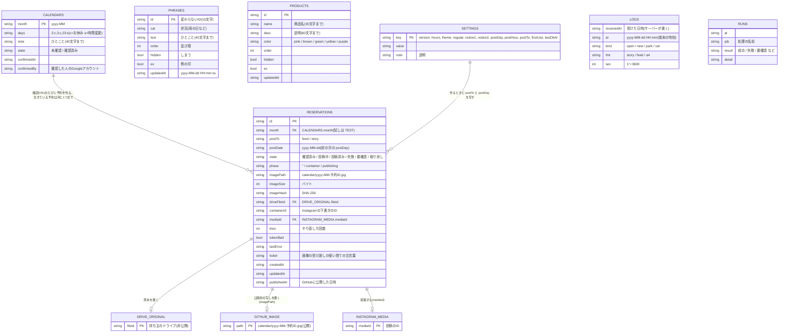
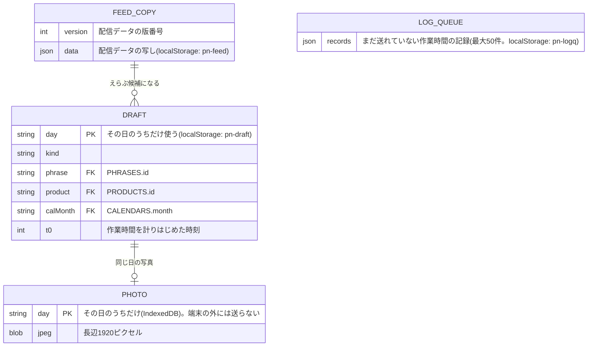
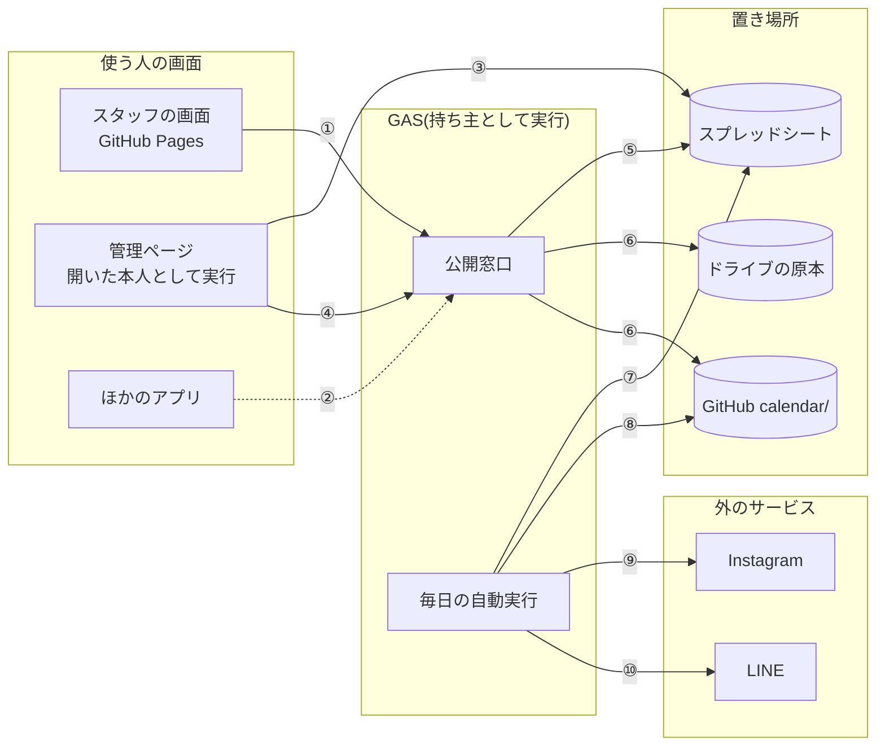

# 投稿ノート データのやり取り(ER図と窓口)

ほかのアプリとつなぐための資料です。データの表(エンティティ)とつながり、どの入り口から何を読み書きできるか、外から使える窓口の形をまとめます。

正しいデータは、Googleスプレッドシート「投稿ノート データ」の1つだけです。ほかの場所にあるもの(端末の写し、配信データ、画像の写し)は、すべてそこから作った写しです。

---

## 1. ER図



### 表の名前の対応

| 図の名前 | シートの名前 | 書く人 |
|---|---|---|
| SETTINGS | 設定 | 管理ページ(登録できる人)。`version` は保存のたびに自動で上がる |
| PHRASES | ひとこと | 管理ページ |
| PRODUCTS | 商品 | 管理ページ |
| CALENDARS | カレンダー | 管理ページ |
| RESERVATIONS | 予約 | 管理ページ(作る・取り消す・「投稿済みにする」「もう一度出す」)と、毎日の自動実行(状態を進める) |
| LOGS | 作業時間 | 公開窓口(追記だけ) |
| RUNS | 動作記録 | 公開窓口と毎日の自動実行(新しい500行だけ残す) |
| DRIVE_ORIGINAL | ドライブのフォルダ「投稿ノート カレンダーの原本」 | 公開窓口 |
| GITHUB_IMAGE | リポジトリの `calendar/` | 公開窓口と毎日の自動実行 |
| INSTAGRAM_MEDIA | Instagram | 毎日の自動実行 |

### データの決まり

- 行には変わらないIDを振る。並べる順番は別の列(`order`)
- 消さずに「しまう」(`hidden`)
- 日付は「2026-11-01」の形の文字、時刻は日本時間。シートの日付型は使わない(すべての列を文字の形式にしてある)
- 見出しの行は持ち主しか直せない。IDの列は、直そうとすると注意が出る
- 配る前にすべての行を検査し、合わない行は配信から外す(管理ページの「直してほしい行」に出る)
- 価格のような文字(500円、¥500 など)は登録できない

---

## 2. 端末の中のデータ(スタッフのスマホごと)



写真と作りかけは、端末の外に出ません。外に送るのは、作業時間の記録(日時・種類・大きさ・秒数)だけです。

---

## 3. だれが、どの入り口から、何をできるか



| 番号 | やり取り |
|---|---|
| ① | スタッフの画面が、配信データを読む(GET)。作業時間の記録を送る(POST) |
| ② | ほかのアプリが、配信データを読む(GET。読むだけ) |
| ③ | 管理ページが、開いた本人の権限でシートを読み書きする(シートの共有が必要) |
| ④ | 管理ページが、カレンダーの画像を、使い捨ての合言葉と一緒に送る(POST) |
| ⑤ | 公開窓口が、シートを読む。作業時間を追記する。予約に画像を結びつける |
| ⑥ | 公開窓口が、画像の原本をドライブに、公開用の写しをGitHubに置く |
| ⑦ | 自動実行が、予約を読み、状態を書く。動作記録を書く |
| ⑧ | 自動実行が、まだ公開していない画像をGitHubに置く(やり直し) |
| ⑨ | 自動実行が、ページのトークンでInstagramに投稿する |
| ⑩ | 自動実行が、確認のお知らせや失敗をLINEで送る |

| 入り口 | だれが | できること |
|---|---|---|
| 公開窓口 GET `?api=feed` | だれでも(URLを知っていれば) | 配信データを読む |
| 公開窓口 POST(作業時間) | だれでも | 作業時間の記録を足す(決まった形だけ、1分30件・1日300件まで) |
| 公開窓口 POST(カレンダーの画像) | 予約の合言葉を知っている人(=シートを編集できる人) | その予約の画像を1回だけ置く |
| 管理ページ | シートを「編集者」として共有された人 | 登録、直す、しまう、カレンダーの確認、予約の片づけ、記録を見る |
| スプレッドシートを直接 | シートを共有された人 | 表で直す(配る前に検査される) |
| 毎日の自動実行 | GASの持ち主の権限 | 予約を投稿し、結果を書く。知らせを送る |

**ほかのアプリから書きこむ窓口はありません。** 書きこむ入り口は、管理ページと、公開窓口の「作業時間の追記」「合言葉つきの画像」だけです。ほかのアプリからデータを足したいときは、シートを共有してもらって表に書くか(配る前に検査されます)、新しい窓口を作る相談をしてください。

---

## 4. 外から使える窓口の形

URLは `config.js` の `feedUrl` です(GASのウェブアプリの `/exec` で終わるURL)。シェフの名義に移すときに変わります。

### 配信データ(GET)

```
GET {feedUrl}?api=feed
```

返り値(JSON。読むのにログインはいりません):

```json
{
  "version": 42,
  "generatedAt": "2026-10-20T12:00:00+09:00",
  "settings": {
    "hours": "10:00 – 18:00",
    "theme": "pink",
    "regular": [1, 2],
    "schedule": { "notice1": 20, "notice2": 23, "postDay": 25, "postHour": 12 },
    "postTo": "feed",
    "firstUse": "2026-10-10"
  },
  "phrases":  [{ "id": "3b19dc1a76", "cat": "雨の日", "text": "足元にお気をつけてお越しください", "ex": true }],
  "products": [{ "id": "2f15956df1", "name": "…", "desc": "…", "color": "pink", "ex": true }],
  "calendars": [{ "month": "2026-11", "days": { "2": "c", "23": "s" }, "note": "23日は営業します" }],
  "calendarState": { "2026-11": "posted", "2026-12": "unconfirmed" },
  "auto": { "lastOkAt": "2026-10-20 12:03:15", "alert": null }
}
```

| 項目 | 中身 |
|---|---|
| `version` | 版番号。前に読んだものと同じなら、中身も同じ。写しが古いかを比べるのに使う |
| `phrases` / `products` | しまったものと、検査に合わない行は入らない。並び順どおり |
| `calendars` | **確認済みの月だけ**。`days` の c はお休み、s は時間変更、ない日は営業 |
| `calendarState` | 月ごとの状態:`unconfirmed`(確認前)/ `confirmed`(確認済み)/ `posted`(投稿済み)。確認前の中身は配らない |
| `auto.lastOkAt` | 毎日の自動実行が最後に正しく動いた日時。2日以上前なら止まっている |
| `auto.alert` | 知らせ(なければ null)。`kind`:`check`(要確認)/ `failed`(失敗)/ `token`(トークンが使えない)と `message` |

配らないもの:作業時間の記録、動作記録、予約の詳しい中身、確認した人、登録できる人の名簿。

返り値は、版番号が変わるまで、公開窓口が作ったものを使い回します(最大6時間)。読むのは1〜数秒かかるので、ほかのアプリでも、手元に写しを持って、裏で新しい版を確かめる形をおすすめします。

### 作業時間の記録(POST)

```
POST {feedUrl}
Content-Type: text/plain

{"records":[{"at":"2026-10-20 11:58","kind":"open","fmt":"story","sec":18}]}
```

- `Content-Type` を `text/plain` にすると、ブラウザから送るときに前もっての問い合わせがいらない
- `at`:日本時間の「yyyy-MM-dd HH:mm」。前後1日をこえるものは受けつけない
- `kind`:`open`(営業中)/ `new`(新作・季節)/ `park`(駐車場)/ `cal`(営業カレンダー)
- `fmt`:`story` / `feed` / `a4`
- `sec`:1〜3600の整数
- 1回に20件まで。ほかの項目は捨てる
- 返り値:`{"ok":true,"accepted":1,"rejected":0}`。混み合っているときは `{"ok":false,"retry":true,…}`(送り直してよい)

### カレンダーの画像(POST、管理ページだけが使う)

```json
{"type":"calendarImage","resId":"予約ID","ticket":"合言葉","image":"JPEGのbase64"}
```

合言葉は、管理ページで「この内容でOK」を押したときに予約の行に書かれ、1回使うと消えます。大きさとSHA-256が予約の記録と合うときだけ受けつけます。ほかのアプリから使う窓口ではありません。

---

## 5. つなぐときに気をつけること

- 配信データは、URLを知っていればだれでも読めます。お客さんに見せてよいものだけが入っています
- 公開窓口のURLは、持ち主を移すときに変わります。URLを1か所(設定ファイルなど)にまとめておいてください
- 時刻はすべて日本時間です
- 予約を作る・投稿するのは、このアプリの中だけです。ほかのアプリがInstagramに投稿すると、二重投稿になるおそれがあります
